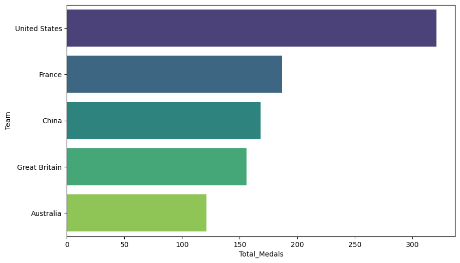
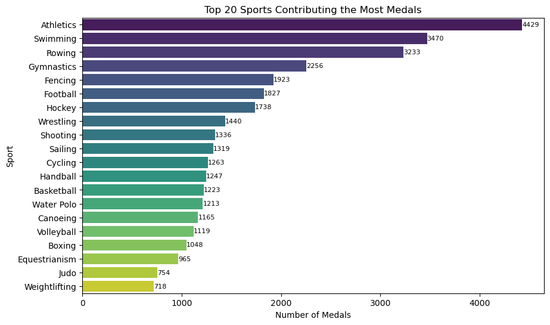
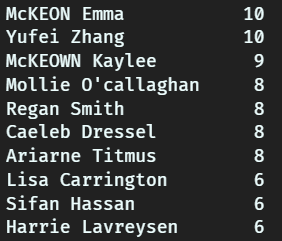
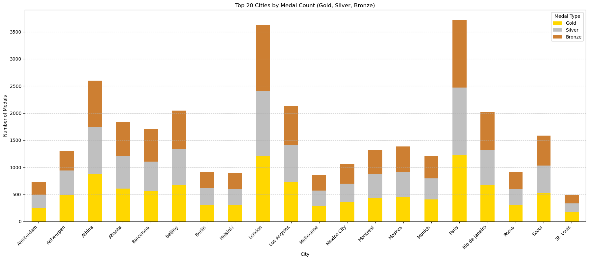

## Summer Olympics Data Analysis

This project analyzes the Summer Olympics dataset (1910–2024) to uncover trends and insights about participation, performance, and medal distribution. The dataset includes information about athletes, events, and medal counts, allowing for an in-depth exploration of historical Olympic data.

## Dataset

The dataset used in this project is publicly available on Kaggle.

You can find the dataset [here](https://www.kaggle.com/datasets/stefanydeoliveira/summer-olympics-medals-1896-2024).

## Analysis Overview

#### 1. Participation Trends

- Trends in athlete participation across years.
- Gender-wise participation analysis.

#### 2. Medal Analysis

- Total medals won by each country.
- Medal counts and ranking countries by total medals over the years.
- Most medals recorded by host cities.

#### 3. Sports and Athlete Insights

- Sports contributing the most medals.
- Consistent top-performing athletes across multiple Olympic Games (post-2008).
- Rising athletes based on performances in recent Olympics

## EDA Insights

- For Year 2024 USA won the most number of medals
  

- Atheletic Sports is contributing the most medals
  

- Top 10 Athletes in the recent Olympics (2020 and 2024)
  

- Most number of medals are recorded in Paris.
  
